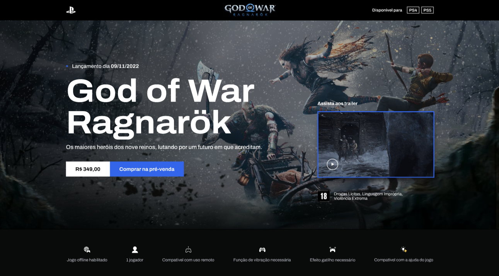

<h1 align="center"> God of War Ragnarök </h1>

  <a href="#-tecnologias">Tecnologias</a>&nbsp;&nbsp;&nbsp;|&nbsp;&nbsp;&nbsp;
  <a href="#-projeto">Projeto</a>&nbsp;&nbsp;&nbsp;|&nbsp;&nbsp;&nbsp;
  <a href="#-deploy">Deploy</a>&nbsp;&nbsp;&nbsp;|&nbsp;&nbsp;&nbsp;
  <a href="#memo-licença">Licença</a>

  

 

  

## 🚀 Tecnologias

Esse projeto foi desenvolvido com as seguintes tecnologias:

- HTML
- SASS
- JavaScript

## 📍 Bibliotecas utilizadas

- Google fonts (https://fonts.google.com/)
- Swiper (https://swiperjs.com/)
- AOS effects (https://michalsnik.github.io/aos/)

## 💻 Projeto

Esse projeto apresenta uma interface do jogo God of War Ragnarök na loja da Playstation.

## 🔖 Deploy

Acesse esse site por: [Vercel](https://god-of-war-rml.vercel.app/)

## :memo: Licença

Esse projeto está sob a licença MIT.

---
